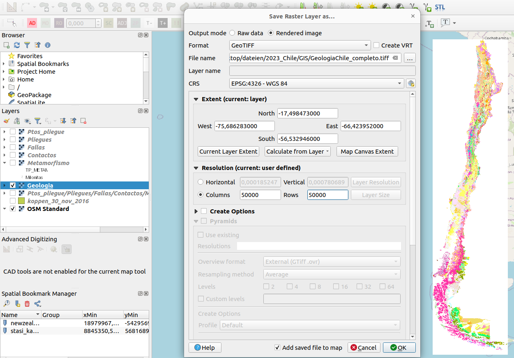

# GIS raster/shapefile to Osmand layer

1. 
2. **Transparenz**: Lade Bild in QGIS. Rechtsklick > Properties > Transparency > Custom Transparency Options: Add value R255 G255 B255 100%
3. Export Raster Layer again

``` bash
gdal_translate in.tiff out.mbtiles
gdaladdo -r nearest out.mbtiles 2 4 8 16 32 128 256 512 1024 2048 # to set zoom levels
./mbtiles2osmand/mbtiles2osmand.py out.mbtiles out.sqlitedb

```
