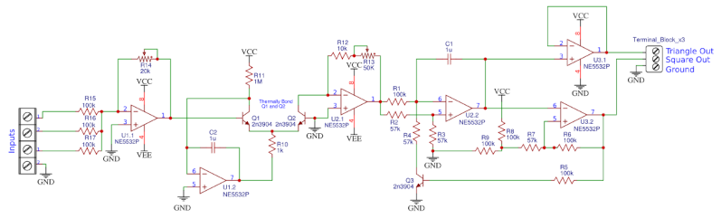
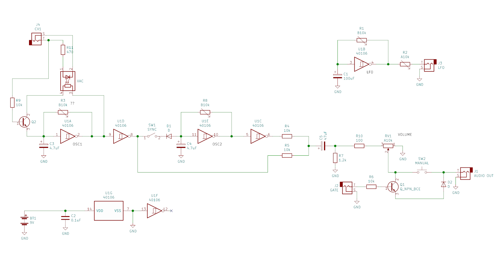

# DIY VCO Synth

## YouTube: DIY Analog Synthesizer

[DIY Analog Synthesizer Part 1: The Voltage Controlled Oscillator (VCO) ](https://www.youtube.com/watch?v=SE9ZtG0E58g)

### schematics: Exponential VCO

https://oshwlab.com/SomethingsGoneWrong/Exponential_VCO

### Bill of Materials

ID  |	Name 	| Designator 	| Footprint 	| Quantity
----|-----------|---------------|---------------|---------
1   |100k 	    |R1,R5,R6,R8,R9,R15,R16,R17 | 	AXIAL-0.3 |	8
2   |1u         |C1,C2 |	RAD-0.1 |	2
3   |57k 	    |R2,R3,R4,R7 |	AXIAL-0.3 | 	4
4   |2n3904     |	Q3 	| TO-92(TO-92-3) |	1
5 	|Terminal_Block_x3 	|TERMINALFUCKINGBLOCK 	| TERMINAL_BLOCK_X3 |	1
6 	|2n3904      |	Q1,Q2 	|SOT-23_1 	| 2
7 	|1k 	    | R10 	|AXIAL-0.3 	| 1
8 	|1M 	    |R11 	|AXIAL-0.3 	| 1
9 	|10k 	   |R12 	|AXIAL-0.3 	| 1
10 	|50K 	  |R13 	|POTENTIOMETER_TRIMMER_BOURNS_3266P 	| 1
11 	|20k 	      |R14 	|RES-ADJ_3386P 	|1
12 	|my_terminal_block_2x 	|U7,U8 	| MY_TERMINAL_BLOCK_2X 	|2
13 	|NE5532P |	U3,U1 |	SOIC-8_150MIL 	| 2
14 	|NE5532P |	U2 	| SOIC8 	|1

## [VCO using 555 Timer](http://learningaboutelectronics.com/Articles/Voltage-controlled-oscillator-VCO-circuit-with-a-555-timer.php)

2022-08-03 at PIF camp. works like a charm!

http://learningaboutelectronics.com/Articles/Voltage-controlled-oscillator-VCO-circuit-with-a-555-timer.php

**Components needed**:

-    555 Timer Chip
-    10KΩ Potentiometer
-    33KΩ resistor
-    10nF ceramic capacitor
-    100nF ceramic capacitor

  

## Using CD40106 as VCO

### 40106 basics

-[YouTube: Synth Diy Guy:  World's easiest oscillator! Introducing the CD40106 ](https://www.youtube.com/watch?v=P4SwaI09Zxc)
- [Making a simple synth with a 40106 oscillator circuit](https://www.youtube.com/watch?v=ulFKLilvr_4)
- [CD40106 Oscillator Bank](https://benjiaomodular.com/post/2021-02-17-40106-oscillator-bank/)

[how to make cd40106 vco?](https://modwiggler.com/forum/viewtopic.php?t=229432)

> you could get rid of Q2 and move R3 to a switch on the jack, so R3 generates a CV when no external CV is present.

## further reading

- Make: Analog Synthesizers
- [some technical oscillation input/output voltage caluclator](http://pcbheaven.com/drcalculus/index.php?calc=st_nonsym_sp)
- [Instructables: Moog Style Synth](https://www.instructables.com/Moog-Style-Synth/)
- [Hackaday: Logic Noise: Sweet, Sweet Oscillator Sounds](https://hackaday.com/2015/02/04/logic-noise-sweet-sweet-oscillator-sounds/)