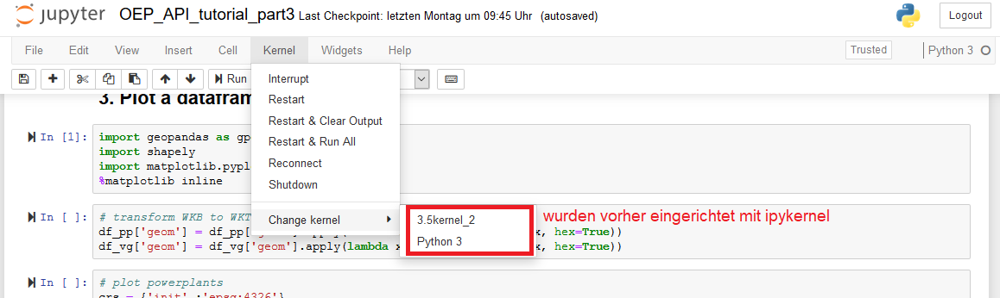

# Python

## Tutorials
[Getting started with Python @ opentechschool](https://opentechschool.github.io/python-beginners/en/getting_started.html#what-is-python-exactly)

## nützliche Befehle
- zum Herausfinden der ausgeführten Python version:
  ``` python
  import sys
  sys.path  # list of strings that specifies the search path for modules
  sys.prefix  # string giving the site-specific directory prefix where the platform independent Python files are installed
  ```
Hinzufügen eines Pfads zu sys.path:
```
import sys
sys.path.insert(0,'/path/to/mod_directory') # am Anfang
sys.path.append(mod_directory) # ans Ende
```

## Installation
- in Windows per Eingabeaufforderung mit [chocolatey](https://chocolatey.org/):  
`choco install python --version X.X`
- im Anaconda Prompt mit z.B. `conda install python=3.5` für Python3.5

## Packages

### General  

Bei Kompatibilitätsproblemen mit von PyPi (pip) bereitgestellten packages können Windows binaries von [Christoph Gohlke](https://www.lfd.uci.edu/~gohlke/pythonlibs/) heruntergeladen werden.

#### How does Python find packages?  
https://leemendelowitz.github.io/blog/how-does-python-find-packages.html  
Python findet Packages, die in den Systempfaden verzeichnet sind:  
`sys.path`  
> When you import a module, you usually can check the __file__ attribute of the module to see where the module is in your filesystem:
``` python
> import numpy
> numpy.__file__
'/usr/local/lib/python2.7/dist-packages/numpy/__init__.pyc'
```   

> imp.find_module can be used to find a module:
``` python
> import imp
> imp.find_module('numpy')
(None, '/usr/local/lib/python2.7/dist-packages/numpy', ('', '', 5))
```


### Geopandas:
#### known issues
01.02.2019
- `C:\Users\David\python\environments\python-atom\Scripts>pip.exe install C:\Users\David\python\packages\geopandas-0.4.0-py2.py3-none-any.whl` failed: _A GDAL API version must be specified. Provide a path to gdal-config using a GDAL_CONFIG environment variable or use a GDAL_VERSION environment variable._
  - bei diesem Fehler ist die manuelle Installation von fiona nötig:  
  `pip.exe install C:\Users\David\python\packages\Fiona-1.8.4-cp37-cp37m-win32.whl` ✓
  - dann kann geopandas fehlerfrei installiert werden:  
   `C:\Users\David\python\environments\python-atom\Scripts>pip.exe install C:\Users\David\python\packages\geopandas-0.4.0-py2.py3-none-any.whl`✓

  - auch einen Versuch wert: in Anaconda Prompt `conda install -c conda-forge gdal`

### ipykernel
zur Ausführung von ipython kernels, worauf z.B. Jupyter Notebook und IPython basiert.  
`python -m ipykernel install --user --name xyz --display-name xyz`  



### Matplotlib
`matplotlib.use('Qt5Agg') # error: cannot load any qt binding`  
`pip install PyQt5`


### Pickle
[pickle Doc](https://docs.python.org/3/library/pickle.html#data-stream-format)
- `pickle.dump()` for serialization  
`pickle.loads()` unpacking  
pickler / unpickler objects for more complex operations

- `pickle.dump(obj, file, protocol=None, *, fix_imports=True)`  
writes a pickled representation of _obj_ to _file_  
equivalent to `Pickler(file, protocol).dump(obj)`  
_file_ argument must have write() method  

- `pickle.dumps(obj, protocol=None, *, fix_imports=True` returns _bytes_ object instead of file  
  --> can be read with ` pickle.loads(bytes_object, *, fix_imports=True, encoding="ASCII", errors="strict")`

- `pickle.load(file, *, fix_imports=True, encoding="ASCII", errors="strict")`  
reads from _file_ and returns stored herarchy  
equivalent to `Unpickler(file).load()`    
no protocol needed  
argument _file_ must have read() and readline() method  
file can be an on-disk file opened for binary reading, an **io.BytesIO** object, or any other custom object that meets this interface.

## Virtual Envs
- in Ubuntu:
  - Using **virtualenv**:
    - create: `virtualenv <dir> --python=python[X]`
    - activate:
    ``` bash
      virtualenv <DIR>
      source <DIR>/bin/activate
    ```
    - deactivate: `deactivate`
  - vitualenvwrapper is an extension for virtualenv

  - Using **venv**:
    ``` bash
      python3 -m venv <DIR>
      source <DIR>/bin/activate
    ```
- in Windows:  
  create new env:
  ``` bash
  python -m venv <name-in-current-dir>
  cd <env-name\scripts\>
  activate
  ```

**Problem: wie installiere ich eine geringere Version von Python in einem schon vorhandenen Environment?**  
- in Anaconda z.B. für Python3.5: 'conda install python==3.5'

---
## Bekannte Probleme, Installationen, Debugging etc.

### installing virtualenvwrapper für (atom-)Python3.7  
01.02.2019  
-   
- `C:\Users\David\AppData\Local\Programs\Python\Python37-32\Scripts` zu PATH hinzugefügt
- für atom ide-python: `pip install python-language-server[all]`✓

- `pip install virtualenvwrapper`  	✓
- `C:\\Users\David\python\environments\` als "Additional Virtualenvs" zu settings von virtualenv in atom hinzugefügt
- dann habe ich python-atom mit dem Virtualenv-Package in Atom aktiviert

### ipykernel für Atom einrichten für _Hydrogen_

 ``` bash
 cd environments\environment\scripts\
 activate
 python -m pip install ipykernel # falls noch nicht geschehen  
 python -m ipykernel install --user --name xyz --display-name xyz
 ```
- restart atom ✓  

**13.03.2019 Einrichtung von ipykernel in virtualenv python-atom:**

``` bash
  cd C:\Users\David\python\environments\python-atom\Scripts\
  activate
  python -m ipykernel install --user --name xyz --display-name xyz
```

⚠ Danach öffnet sich beim Start von Atom Windows-Administrationsprompt.. ebenso beim Start von Hydrogen

Hydrogen `Unexpected EOF`:  
besser als run line ist dann run cell mit Ctrl+Alt+Enter
### Ausführung von cartopy_convert.py aus geopandas_examples
01.02.2019
- `pip install matplotlib`
`C:\Users\David\resEnergiesysteme\00_misc\geopandas_examples\gallery_python\cartopy_convert.py`
- Versuche geopandas zu importieren.
  _OSError: Could not find lib geos_c.dll or load any of its variants ['C:\\Users\\David\\python\\environments\\python-atom\\Library\\lib\\geos_c.dll']._   
    - `pip install C:\Users\David\python\GDAL-2.3.2-cp37-cp37m-win32.whl` _(Fehler weiterhin vorhanden)_
    - `pip install geos`   _(Fehler bleibt)_
    - GEOS für Windows eingerichtet wie [hier](https://stackoverflow.com/questions/5177498/how-to-install-geos-for-geodjango-on-windows) und [hier](https://stackoverflow.com/questions/5177498/how-to-install-geos-for-geodjango-on-windows) beschrieben:
      ``` bash
      set OSGEO4W_ROOT=C:\OSGeo4W
      set GDAL_DATA=%OSGEO4W_ROOT%\share\gdal
      set PROJ_LIB=%OSGEO4W_ROOT%\share\proj
      set PATH=%PATH%;%OSGEO4W_ROOT%\bin
      reg ADD "HKLM\SYSTEM\CurrentControlSet\Control\Session Manager\Environment" /v Path /t REG_EXPAND_SZ /f /d "%PATH%"
      reg ADD "HKLM\SYSTEM\CurrentControlSet\Control\Session Manager\Environment" /v GDAL_DATA /t REG_EXPAND_SZ /f /d "%GDAL_DATA%"
      reg ADD "HKLM\SYSTEM\CurrentControlSet\Control\Session Manager\Environment" /v PROJ_LIB /t REG_EXPAND_SZ /f /d "%PROJ_LIB%"
      ```
  (15.03.2019)  
  `import geopandas` scheitert mit Fehler  

  `OSError: Could not find lib geos_c.dll or load any of its variants ['C:\\Users\\David\\python\\environments\\python-atom\\Library\\lib\\geos_c.dll'].`  

  versuchte Lösungen:
    - `pip install geos`
    - `pip install glibc`
    - gdal von Gohlke  
    -> restart Atom.. Fehler bleibt.

## Packages Compendium
### Data Handling  
#### **Pandas**
 [10 Minutes to Pandas](http://pandas.pydata.org/pandas-docs/stable/getting_started/10min.html)  
Getting: Selecting a single column, which yields a Series, equivalent to df.A:
``` python
In [23]: df['A']
Out[23]:
2013-01-01    0.469112
2013-01-02    1.212112
2013-01-03   -0.861849
2013-01-04    0.721555
2013-01-05   -0.424972
2013-01-06   -0.673690
Freq: D, Name: A, dtype: float64
```


### Python for Energy Systems
#### **PyPSA**
Python for Power System Analysis  
[PyPSA on github](https://github.com/PyPSA/PyPSA)


### Geospatial Python  
#### **Contextily**  
R/W tile maps from the internet into raster files  
[contextily on github](https://github.com/darribas/contextily)  

#### **Shapely**  
for manipulation and analysis of planar geometric objects 	 

---
