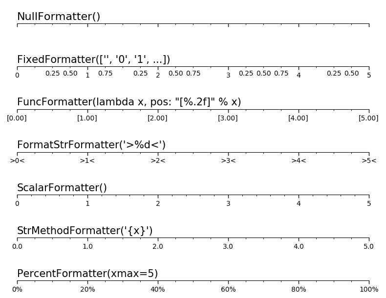
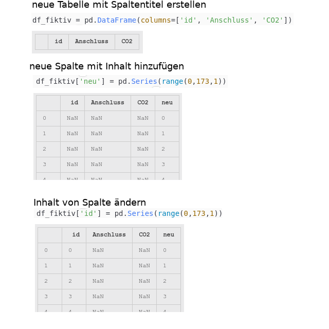

# Packages Cheat Sheets
Collection of small applications I have used the packages for.

## Matplotlib

### General
#### bekannte Fehler:
- `plt.show()` zeigt nichts an:
  - nutze `plt.figure` anstelle von subplots
  - ODER: ändere das Backend!
  `matplotlib.use('renderer')` **muss vor `import matplotlib.pyplot` geschehen!**  
  --> `matplotlib.rcsetup.all_backends` displays all possible Strings

- `matplotlib.use('Qt5Agg') # error: cannot load any qt binding`  
**--> Ubuntu:** `pip install PyQt5`  
**--> Win 10:** download Qt5 from from qt.io; (install PyQt5?)

- Wenn matplotlib nach Ausführen des Skripts alle Figs schließt, versuche die Zeile `matplotlib.use('Qt5Agg')` erneut auszuführen.

### Plots
#### simple plot

``` python
import matplotlib
import matplotlib.pyplot as plt
import numpy as np

# Data for plotting
t = np.arange(0.0, 2.0, 0.01)
s = 1 + np.sin(2 * np.pi * t)

fig, ax = plt.subplots()
ax.plot(t, s)

ax.set(xlabel='time (s)', ylabel='voltage (mV)',
       title='About as simple as it gets, folks')
ax.grid()

fig.savefig("test.png")
plt.show()
```

### Plot Design
#### Position und Größe des Fensters bestimmen
- using Qt5:  
`plt.get_current_fig_manager().window.setGeometry(x,y,w,h)  # defines position for figure. (x, y, w, h from upper left screen margin) Only works with QT backend`

#### subplots:
`fig.subplots_adjust(left=0.08, right=0.98, bottom=0.05, top=0.9, hspace=0.4, wspace=0.3)`

#### Legende
- Legende außerhalb von Plot: `plt.legend(loc='best', bbox_to_anchor=(1.45,1))`  

#### Ticks
[Übersicht Tick-Formatter:](https://matplotlib.org/3.1.1/gallery/ticks_and_spines/tick-formatters.html)  


``` python
# FormatStr formatter
ax = fig.add_subplot(n, 1, 4)
setup(ax)
ax.xaxis.set_major_locator(ticker.MultipleLocator(1.00))
ax.xaxis.set_minor_locator(ticker.MultipleLocator(0.25))
ax.xaxis.set_major_formatter(ticker.FormatStrFormatter(">%d<"))
ax.text(0.0, 0.1, "FormatStrFormatter('>%d<')",
        fontsize=15, transform=ax.transAxes)
```
### boxplot
`ax.boxplot(dataArray)`  
https://matplotlib.org/3.1.1/api/_as_gen/matplotlib.pyplot.boxplot.html  
https://matplotlib.org/3.1.1/gallery/statistics/boxplot_demo.html  
https://en.wikipedia.org/wiki/Quartile  
  

### Animation
https://brushingupscience.com/2016/06/21/matplotlib-animations-the-easy-way/  
https://matplotlib.org/3.1.1/api/animation_api.html  
simple plot animation with draw() instead of plotting repetitively  

``` python
# %%
import matplotlib
matplotlib.use('Qt5Agg')
import matplotlib.pyplot as plt
import random

ysample = random.sample(range(-50, 50), 100)

xdata = []
ydata = []

plt.show()

axes = plt.gca()
axes.set_xlim(0, 100)
axes.set_ylim(-50, +50)
line, = axes.plot(xdata, ydata, 'r-')

for i in range(100):
    xdata.append(i)
    ydata.append(ysample[i])
    line.set_xdata(xdata)
    line.set_ydata(ydata)
    plt.draw()
    plt.pause(0.1)

# add this if you don't want the window to disappear at the end
plt.show()
```

### Draw between subplots:
https://www.cilyan.org/blog/2016/01/23/matplotlib-draw-between-subplots/

---

## Pandas DataFrames:  
`df` for DataFrames

### Meta:
- get rows: `len(df.index)`  
- get shape of object types of the data `df.info()`  
- summary of statistics for numerical colums in the DataFrame: `df.describe()`

### Creation:


### Accessing:
get cells:  
- `df.column('row')`  
- `df.loc['row', 'col']`  
- `df.iloc[4,2]` # [row, col]  

- selecting several columns: `df_new = df[['col1', 'col2']]`

### Filtering rows and creating columns:
[Selecting Rows in Pandas Dataframes based on conditions](https://www.geeksforgeeks.org/selecting-rows-in-pandas-dataframe-based-on-conditions/)  
- get all cells with entry >= 5: `df[df['column'] >= 5]`  
- single condition: `rslt_df = dataframe[dataframe['Percentage'] > 80] `
- multiple conditions: `rslt_df = dataframe[(dataframe['Age'] == 21) & dataframe['Stream'].isin(options)] `

add new column with operation: `df['new_col'] = df['some col'] * df['col B']`

### Altering DataFrames:

`pd.DataFrame.drop()` Drop specified labels from rows or columns.  
`df.sort_values(by="column_name", axis=0, ascending=True, inplace=False, kind='quicksort', na_position='last')` sort by the values along either axis

changing rows and colums: `df = df.transpose()`  

#### merging
[merging DataFrames](https://pandas.pydata.org/pandas-docs/stable/user_guide/merging.html#brief-primer-on-merge-methods-relational-algebra):

`pd.DataFrame.merge()` Merge DataFrame or named Series objects with a database-style join.  

``` python
table = pd.DataFrame(columns=['id', 'osm_id', 'lons', 'lats']) # table 1
table['osm_id'] = table['osm_id'].astype(int) # make sure the type is the same

table2 = gebaeudeliste_import = pd.read_csv('Gebaeudeliste_import.csv', delimiter=';')

table = table.merge(table2, on='osm_id', how='left')

```

#### Changing index title:
https://stackoverflow.com/questions/19851005/rename-pandas-dataframe-index


#### [pandas.Index](http://pandas.pydata.org/pandas-docs/stable/reference/api/pandas.Index.html):  
> class pandas.Index[source]  
>    Immutable ndarray implementing an ordered, sliceable set. The basic object storing axis labels for all pandas objects.

### Anwendungsbeispiele

#### DataFrame für ein Jahr erzeugen:

``` python
# Create DataFrame for 2010
demand = pd.DataFrame(
    index=pd.date_range(pd.datetime(2010, 1, 1, 0),
                        periods=8760, freq='H'))
```
  `freq=H` for frequeny=hourly [s. pandas-docs](https://pandas.pydata.org/pandas-docs/stable/user_guide/timeseries.html#timeseries-offset-aliases)

#### mit weiteren Spalten füllen:  
``` python
demand['efh'] = bdew.HeatBuilding(
    demand.index, holidays=holidays, temperature=temperature,
    shlp_type='EFH',
    building_class=1, wind_class=1, annual_heat_demand=25000,
    name='EFH').get_bdew_profile()
```

---
## Shapely
get points from polygon:
``` python
polygon = some_polygon
pol_list = list(polygon.exterior.coords)
pol_df = pd.DataFrame(pol_list, columns=['long', 'lat'])
```

---
## Numpy  
`np.array(python_list)` creates numpy-array from python list  
`np.shape` returns (rows, columns)  
`array_B = array_A < 5` returns an array of booleans..  
  `array_A[array_B]` will then return only the values where B = True  
`array[0,1]` row 0, col 1  
`array[:,5]` all rows, col 5 (complete column 5)  
`array[2:5, 3:10]` row 2-5, col 3-10  


## Excel / csv:
`hour_factors = pd.read_csv(file, index_col=0)`
