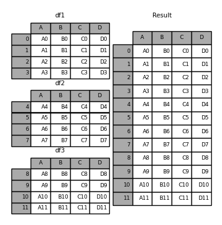
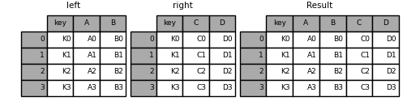

# Pandas DataFrames:  
`df` for DataFrames

## Meta:
- get rows: `len(df.index)`  
- get shape of object types of the data `df.info()`  
- summary of statistics for numerical colums in the DataFrame: `df.describe()`

## Creation:

### create table and add columns:


**from dict**: `pd.DataFrame({'asd': [0,1,2], 'qwe': [7,8,9]}, index=[0]})` or `pd.DataFrame.from_dict(dict)`

### adding rows:

- a) `df.loc[len(df.index)] = [value1, value2, ...]`
- b) `df = df.append(df2, ignore_index=True)`

## Accessing:
get column:
- `df['column']`

get cells:  
- `df.column('row')`  
- `df.loc['row', 'col']`  
- `df.iloc[4,2]` # [row, col]  

- selecting several columns: `df_new = df[['col1', 'col2']]`

## Iteration
Iterate the rows of the DataFrame, and print each "firstname":

``` python
import pandas as pd

data = {
  "firstname": ["Sally", "Mary", "John"],
  "age": [50, 40, 30]
}

df = pd.DataFrame(data)

for index, row in df.iterrows():
  print(row["firstname"]) 
```


## Filtering rows and creating columns:
[Selecting Rows in Pandas Dataframes based on conditions](https://www.geeksforgeeks.org/selecting-rows-in-pandas-dataframe-based-on-conditions/)  
- get all cells with entry >= 5: `df[df['column'] >= 5]`  
- single condition: `rslt_df = dataframe[dataframe['Percentage'] > 80] `
- multiple conditions: `rslt_df = dataframe[(dataframe['Age'] == 21) & dataframe['Stream'].isin(options)] `

add new column with operation: `df['new_col'] = df['some col'] * df['col B']`

### comparing DataFrames:

- `Series.ne(other, level=None, fill_value=None, axis=0)`: Return **Not equal** to of series and other, element-wise.
- any changes in dataframe?
    - `if (previous_frame['col'].ne(current_frame['col'].any()): pass`


## Altering DataFrames:

### Replace values in column based on condition:

`DataFrame.loc[condition, column_name] = new_value`

e.g.

``` python
import pandas as pd

df = pd.DataFrame([
	[-10, -9, 8],
	[6, 2, -4],
	[-8, 5, 1]],
	columns=['a', 'b', 'c'])

df.loc[(df.a < 0), 'a'] = 0
print(df)
```


### misc

`pd.DataFrame.drop()` Drop specified labels from rows or columns.  
`df.sort_values(by="column_name", axis=0, ascending=True, inplace=False, kind='quicksort', na_position='last')` sort by the values along either axis

changing rows and colums: `df = df.transpose()`  

### concat

``` python
frames = [df1, df2, df3]
result = pd.concat(frames)
```




### merge
[merging DataFrames](https://pandas.pydata.org/pandas-docs/stable/user_guide/merging.html#brief-primer-on-merge-methods-relational-algebra):

`pd.DataFrame.merge()` Merge DataFrame or named Series objects with a database-style join.  


``` python
table = pd.DataFrame(columns=['id', 'osm_id', 'lons', 'lats']) # table 1
table['osm_id'] = table['osm_id'].astype(int) # make sure the type is the same

table2 = gebaeudeliste_import = pd.read_csv('Gebaeudeliste_import.csv', delimiter=';')

table = table.merge(table2, on='osm_id', how='left')

```

### Changing index title:
https://stackoverflow.com/questions/19851005/rename-pandas-dataframe-index  
`df.set_index('A')`:

```
In [1]: df = pd.DataFrame([[1, 2, 3], [4, 5 ,6]], columns=list('ABC'))

In [2]: df
Out[2]: 
   A  B  C
0  1  2  3
1  4  5  6

In [3]: df1 = df.set_index('A')

In [4]: df1
Out[4]: 
   B  C
A      
1  2  3
4  5  6
```

### rename DataFrame headers:
`df.rename()`

``` python
df = df.rename(columns={'oldName1': 'newName1', 'oldName2': 'newName2'})
# Or rename the existing DataFrame (rather than creating a copy) 
df.rename(columns={'oldName1': 'newName1', 'oldName2': 'newName2'}, inplace=True)

df

   a  b  c  d  e
0  x  x  x  x  x
1  x  x  x  x  x
2  x  x  x  x  x

df2 = df.rename({'a': 'X', 'b': 'Y'}, axis=1)  # new method
df2 = df.rename({'a': 'X', 'b': 'Y'}, axis='columns')
df2 = df.rename(columns={'a': 'X', 'b': 'Y'})  # old method  

df2

   X  Y  c  d  e
0  x  x  x  x  x
1  x  x  x  x  x
2  x  x  x  x  x
```


### [pandas.Index](http://pandas.pydata.org/pandas-docs/stable/reference/api/pandas.Index.html):  
> class pandas.Index[source]  
>    Immutable ndarray implementing an ordered, sliceable set. The basic object storing axis labels for all pandas objects.

## Anwendungsbeispiele

### DataFrame für ein Jahr erzeugen:

``` python
# Create DataFrame for 2010
demand = pd.DataFrame(
    index=pd.date_range(pd.datetime(2010, 1, 1, 0),
                        periods=8760, freq='H'))
```
  `freq=H` for frequeny=hourly [s. pandas-docs](https://pandas.pydata.org/pandas-docs/stable/user_guide/timeseries.html#timeseries-offset-aliases)

### mit weiteren Spalten füllen:  
``` python
demand['efh'] = bdew.HeatBuilding(
    demand.index, holidays=holidays, temperature=temperature,
    shlp_type='EFH',
    building_class=1, wind_class=1, annual_heat_demand=25000,
    name='EFH').get_bdew_profile()
```
