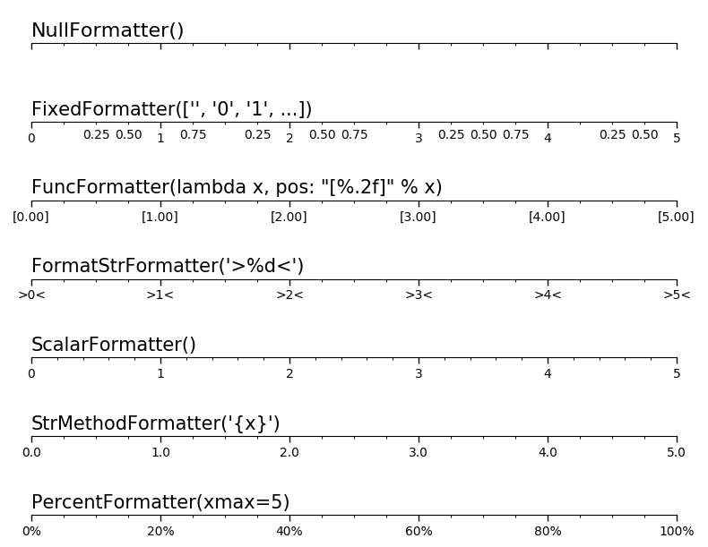

## Matplotlib

### General
#### bekannte Fehler:
- `plt.show()` zeigt nichts an:
  - nutze `plt.figure` anstelle von subplots
  - ODER: ändere das Backend!
  `matplotlib.use('renderer')` **muss vor `import matplotlib.pyplot` geschehen!**  
  --> `matplotlib.rcsetup.all_backends` displays all possible Strings

- `matplotlib.use('Qt5Agg') # error: cannot load any qt binding`  
**--> Ubuntu:** `pip install PyQt5`  
**--> Win 10:** download Qt5 from from qt.io; (install PyQt5?)

- Wenn matplotlib nach Ausführen des Skripts alle Figs schließt, versuche die Zeile `matplotlib.use('Qt5Agg')` erneut auszuführen.

### Plots
#### simple plot

``` python
import matplotlib
import matplotlib.pyplot as plt
import numpy as np

# Data for plotting
t = np.arange(0.0, 2.0, 0.01)
s = 1 + np.sin(2 * np.pi * t)

fig, ax = plt.subplots()
ax.plot(t, s)

ax.set(xlabel='time (s)', ylabel='voltage (mV)',
       title='About as simple as it gets, folks')
ax.grid()

fig.savefig("test.png")
plt.show()
```

### Plot Design
#### Position und Größe des Fensters bestimmen
- using Qt5:  
`plt.get_current_fig_manager().window.setGeometry(x,y,w,h)  # defines position for figure. (x, y, w, h from upper left screen margin) Only works with QT backend`

#### subplots:
`fig.subplots_adjust(left=0.08, right=0.98, bottom=0.05, top=0.9, hspace=0.4, wspace=0.3)`

#### Legende
- Legende außerhalb von Plot: `plt.legend(loc='best', bbox_to_anchor=(1.45,1))`  

#### Ticks
[Übersicht Tick-Formatter:](https://matplotlib.org/3.1.1/gallery/ticks_and_spines/tick-formatters.html)  


``` python
# FormatStr formatter
ax = fig.add_subplot(n, 1, 4)
setup(ax)
ax.xaxis.set_major_locator(ticker.MultipleLocator(1.00))
ax.xaxis.set_minor_locator(ticker.MultipleLocator(0.25))
ax.xaxis.set_major_formatter(ticker.FormatStrFormatter(">%d<"))
ax.text(0.0, 0.1, "FormatStrFormatter('>%d<')",
        fontsize=15, transform=ax.transAxes)
```
### boxplot
`ax.boxplot(dataArray)`  
https://matplotlib.org/3.1.1/api/_as_gen/matplotlib.pyplot.boxplot.html  
https://matplotlib.org/3.1.1/gallery/statistics/boxplot_demo.html  
https://en.wikipedia.org/wiki/Quartile  

### Animation
https://brushingupscience.com/2016/06/21/matplotlib-animations-the-easy-way/  
https://matplotlib.org/3.1.1/api/animation_api.html  
simple plot animation with draw() instead of plotting repetitively  

``` python
# %%
import matplotlib
matplotlib.use('Qt5Agg')
import matplotlib.pyplot as plt
import random

ysample = random.sample(range(-50, 50), 100)

xdata = []
ydata = []

plt.show()

axes = plt.gca()
axes.set_xlim(0, 100)
axes.set_ylim(-50, +50)
line, = axes.plot(xdata, ydata, 'r-')

for i in range(100):
    xdata.append(i)
    ydata.append(ysample[i])
    line.set_xdata(xdata)
    line.set_ydata(ydata)
    plt.draw()
    plt.pause(0.1)

# add this if you don't want the window to disappear at the end
plt.show()
```

### Draw between subplots:
https://www.cilyan.org/blog/2016/01/23/matplotlib-draw-between-subplots/

